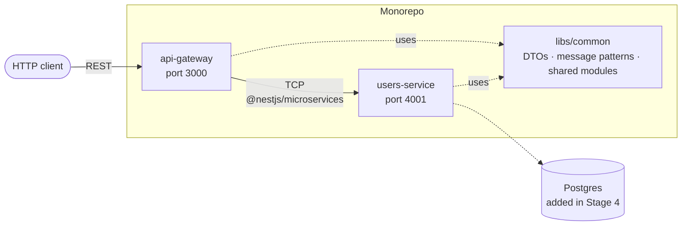

# Docker + NestJS — Learning Repo (Kubernetes-bound)

A hands-on, staged path to real Docker fluency using a **NestJS microservices monorepo**, deliberately shaped so that every habit you build here transfers cleanly to Kubernetes.

> **Goal:** By the end you should be able to ship each microservice as an independent image that a Kubernetes cluster would happily schedule, restart, scale, and roll back — without you having to rewrite it.

---

## The application we're building

Two microservices in a single NestJS monorepo, plus one shared library. Small enough to fit in your head; realistic enough to demonstrate every containerization concept we care about.



| Piece | Kind | Role | Why we picked it |
|---|---|---|---|
| `apps/api-gateway` | Application | Only externally-exposed service; HTTP REST | Teaches the "edge vs internal" split that K8s Ingress + Services enforce |
| `apps/users-service` | Application | Internal microservice, TCP transport | No broker needed to start — swap to Redis/NATS later to prove "code stays, deploy changes" |
| `libs/common` | Library | Shared DTOs, message patterns, later a shared health module | Forces the hardest Docker question early: "how do I build one service from a monorepo without shipping the others?" |

**Why NestJS built-in monorepo (not Nx/Turbo)?** Zero extra tooling. One `package.json`. Native, documented, easy to reason about when writing Dockerfiles. If we outgrow it we'll graduate later — you'll know why.

**Why start with 2 services?** Enough to demonstrate service-to-service communication, per-service Dockerfiles, and Compose networking, without you drowning in code you didn't write.

---

## How this repo is organised

```
docker-nestjs-learning/
├── README.md                   ← you are here (index + progress tracker)
├── LEARNING-APPROACH.md        ← the method (read this once, then stop tutorial-scrolling)
├── package.json                ← created in Stage 2 (pins Yarn 4 via "packageManager")
├── yarn.lock                   ← created in Stage 2 (deterministic deps for laptop + CI + Docker)
├── .yarnrc.yml                 ← created in Stage 2 (nodeLinker: node-modules)
├── tsconfig.json               ← created in Stage 2
├── nest-cli.json               ← created in Stage 2
├── apps/                       ← created in Stage 2
│   ├── api-gateway/
│   └── users-service/
├── libs/                       ← created in Stage 2
│   └── common/
├── cheatsheets/                ← quick-reference, populated as we go
│   ├── commands.md             ← project runbook — build / run / debug / cleanup
│   ├── docker-cli.md
│   ├── dockerfile.md
│   └── compose.md
└── stages/
    ├── 00-orientation/         ← mental model, no code
    ├── 01-docker-fundamentals/ ← play with pre-built images
    ├── 02-first-nestjs-dockerfile/    ← scaffold the monorepo + naive Dockerfile
    ├── 03-production-dockerfile/      ← multi-stage per-service builds
    ├── 04-compose-multi-service/      ← + Postgres + Redis, networks, volumes
    ├── 05-image-slimming-and-security/
    ├── 06-twelve-factor-and-k8s-readiness/
    ├── 07-dev-workflows/
    ├── 08-registry-and-ci/
    └── 09-bridge-to-kubernetes/
```

**Package manager:** Yarn 4, activated via Corepack (built into Node 22). The exact Yarn release is pinned in `package.json`'s `packageManager` field; Corepack downloads that exact version on demand and caches it in `~/.cache/node/corepack/`. Every environment — your laptop, a teammate, CI, and every Docker build stage — ends up running bit-identical Yarn.

Each stage folder contains:

- `README.md` — the concepts, in your own future words (I write the scaffolding, you extend).
- `NOTES.md` — your personal journal for that stage. Fill it in *as you go*, not after.
- `CHALLENGES.md` — 3–5 self-check questions. If you can't answer without looking, re-do the stage.
- Code / Dockerfiles / compose files as needed.

---

## The stages

| # | Stage | Status | What you'll build | Kubernetes payoff |
|---|---|---|---|---|
| 0 | [Orientation & mental model](stages/00-orientation/README.md) | ⬜ | Nothing runnable — just the map | Understand what a Pod actually runs |
| 1 | [Docker fundamentals](stages/01-docker-fundamentals/README.md) | ⬜ | Play with images, layers, containers, volumes, networks using stock images | `kubectl run`, image pull, ephemeral filesystems |
| 2 | [Scaffold monorepo + naive Dockerfile](stages/02-first-nestjs-dockerfile/README.md) | ⬜ | Hand-built NestJS monorepo (2 apps + shared lib) + a *deliberately bad* Dockerfile for one service | See what NOT to hand to a cluster |
| 3 | [Production Dockerfile per service](stages/03-production-dockerfile/README.md) | ⬜ | Multi-stage per-service build, non-root, PID 1 signal handling, HEALTHCHECK | Maps 1:1 to Pod securityContext + probes |
| 4 | [Compose: gateway + users-service + Postgres + Redis](stages/04-compose-multi-service/README.md) | ⬜ | Real inter-service networking, named volumes, profiles, `compose watch` | Manifests, Services, ConfigMaps, PVCs |
| 5 | [Image slimming & supply chain](stages/05-image-slimming-and-security/README.md) | ⬜ | `.dockerignore`, distroless vs alpine, `dive`, `trivy`, SBOM, multi-arch buildx | Cluster security, admission policies |
| 6 | [12-Factor & K8s-readiness](stages/06-twelve-factor-and-k8s-readiness/README.md) | ⬜ | Env config via `@nestjs/config`, JSON logs to stdout, `/livez` & `/readyz` in each service, graceful SIGTERM | Probes, HPA, rolling updates |
| 7 | [Dev workflows](stages/07-dev-workflows/README.md) | ⬜ | Hot reload via bind mount, debugger attach, tests-in-container | Later: Skaffold/Tilt for k8s |
| 8 | [Registry & CI](stages/08-registry-and-ci/README.md) | ⬜ | Push both images to GHCR, tagging strategy (semver + git SHA), build cache in CI | GitOps-ready images |
| 9 | [Bridge to Kubernetes](stages/09-bridge-to-kubernetes/README.md) | ⬜ | Run *both* images in `kind`; translate compose → manifests by hand | Smooth landing into your K8s learning |

Flip `⬜ → ✅` as you finish each. Don't skip stages — later ones assume earlier habits.

---

## Ground rules

1. **Type every command yourself.** Copy-paste kills learning. If you must copy, retype it.
2. **Break it first.** Every stage has a "do it wrong" step. Do it. Watch it fail. Then fix.
3. **Write in your own words** in `NOTES.md`. Explaining to future-you is the real test.
4. **Never `docker run` without knowing what image you pulled.** Registry hygiene starts on day one.
5. **Assume Kubernetes is watching.** If a habit wouldn't work in a Pod, we don't build it here.

---

## Prerequisites (already verified)

- Docker Engine 28.x with Compose v2 ✅
- Node.js 22.x ✅
- A terminal you're comfortable in
- Basic NestJS understanding (controllers, modules, providers) ✅ (per your statement)

See [LEARNING-APPROACH.md](LEARNING-APPROACH.md) before starting Stage 0.
