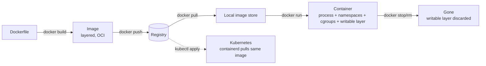

# Stage 0 — Orientation & mental model

**Time:** ~30 min reading + 10 min journaling. **No terminal work.**
**Goal:** Build a correct mental model of what containers *actually* are, so nothing later feels like magic.

---

## 1. The single most important idea

> A container is **just a Linux process** (or a small group of them) running on your host kernel, with a private view of the filesystem, network, users, and process tree.

There is no "little VM" inside your machine. When you run:

```bash
docker run nginx
```

…the `nginx` process runs on **your** host kernel. Docker uses three Linux kernel features to make it *feel* isolated:

| Kernel feature | What it gives the container |
|---|---|
| **Namespaces** | A private view: its own PID 1, its own network interfaces, its own mount tree, its own hostname, its own users. |
| **cgroups** | Limits: how much CPU, RAM, IO, PIDs it can consume. |
| **Union filesystem** (overlayfs) | A layered, copy-on-write filesystem stacked from image layers + a writable top layer. |

That's it. No hypervisor. No guest OS. Just a process with a really convincing costume.

**Consequence:** a Linux container needs a Linux kernel. On macOS/Windows, Docker Desktop silently runs a tiny Linux VM to host the container runtime — you're running on that VM's kernel, not your host's.

---

## 2. Image vs. container — the noun/verb split

| Term | What it is | Analogy |
|---|---|---|
| **Image** | A read-only, layered, hash-addressed blob of files + metadata (env vars, entrypoint, exposed ports, user, etc.). Stored in a registry. | A class definition. Or a stopped photograph. |
| **Container** | A running (or stopped) *instance* of an image, with a writable top layer and a set of namespaces/cgroups. | An object / an instance. |
| **Registry** | A server that stores and serves images by name + tag + digest (Docker Hub, GHCR, ECR, Artifact Registry). | npm, but for images. |
| **Layer** | One tarball diff in an image. Each `RUN`/`COPY`/`ADD` in a Dockerfile produces one. Layers are cached and shared across images. | A git commit — additive, hashable, reusable. |
| **Tag** | A human-readable pointer to a specific image (`nestjs-app:1.2.3`). *Mutable* — someone can retag `:latest` tomorrow. | A git branch. |
| **Digest** | A `sha256:…` content hash. *Immutable* — always the exact same bytes. | A git commit SHA. |

**Habit to build now:** in production and in Kubernetes manifests, pin to digests (`myapp@sha256:abcd…`), not to tags like `:latest`. Tags lie; digests don't. We'll do this in Stage 8.

---

## 3. The OCI standard (why "Docker" ≠ "containers")

"Docker" is a company and a tool. **OCI** (Open Container Initiative) is the *standard* that defines:

- **Image format** — the on-disk layout of an image.
- **Runtime spec** — how a runtime should turn an image into a running container.
- **Distribution spec** — how registries serve images.

Because these are open standards:

- Kubernetes doesn't use Docker anymore. It uses **containerd** or **CRI-O** as the runtime.
- The image you build with `docker build` will run on Kubernetes even though Docker Engine isn't there — because it's an OCI image, not a "Docker image."
- Alternative builders exist: `buildah`, `kaniko`, `podman build`, `nerdctl`. They all produce OCI images.

**Consequence for you:** the skills transfer. Everything you learn about Dockerfiles, images, and layers applies unchanged to Kubernetes.

---

## 4. The layered filesystem — why it matters for speed and cost

An image is a *stack* of read-only layers. When you start a container, the runtime adds a thin writable layer on top:

```
┌────────────────────────────┐  ← writable (container-only, discarded on rm)
│  container writable layer  │
├────────────────────────────┤
│  layer: COPY dist/         │  ← from your Dockerfile
├────────────────────────────┤
│  layer: RUN npm ci         │
├────────────────────────────┤
│  layer: COPY package*.json │
├────────────────────────────┤
│  layer: node:22-alpine     │  ← base image (shared across all your Node projects)
└────────────────────────────┘
```

Why this matters:

- **Build cache:** if a layer's inputs haven't changed, Docker reuses the cached layer. Order your Dockerfile so *stable* things (dependencies) come *before* *volatile* things (source code). We'll practice this in Stage 3.
- **Registry pulls are diffs:** pulling a new image version only downloads *changed* layers. A well-structured image updates in seconds; a badly structured one re-pulls hundreds of MB every deploy. This directly affects Kubernetes rollout speed.
- **The writable layer is ephemeral:** `docker rm` deletes it. Anything you `docker exec` in and write is *gone*. This is why state belongs in volumes, not in the container. **In Kubernetes this is even stricter** — Pods are routinely killed and recreated.

---

## 5. The mental checkpoint

Before Stage 1, you should be able to answer these in your head:

1. If I run the same image on Linux and on macOS Docker Desktop, whose kernel is the container actually using?
2. What's the difference between an image tag and an image digest, and which one would you pin in a Kubernetes manifest?
3. Why does the order of instructions in a Dockerfile affect build speed?
4. If I write a file inside a running container using `docker exec`, and then the container restarts (or Kubernetes reschedules the Pod), where does that file go?
5. Kubernetes doesn't run Docker. Why does the image I build with `docker build` still work there?

If any of those are shaky, re-read the relevant section above before continuing.

---

## 6. Diagram — how a container is born



Note the dashed arrow: **the same image** flows to your laptop and to a cluster. That's the whole point of this journey.

---

## Fill in [NOTES.md](NOTES.md), then move to [Stage 1](../01-docker-fundamentals/README.md).
