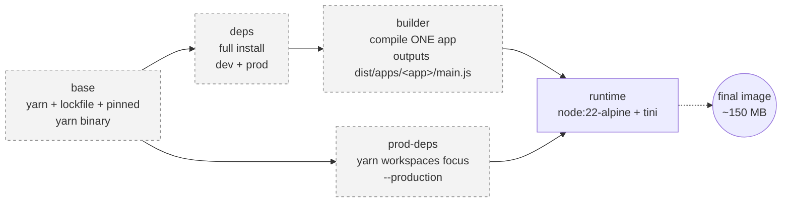

# Stage 3 — Production Dockerfile per service

**Time:** ~2 hours (understanding + building both services + measuring)
**Goal:** Replace the 398 MB naive image from Stage 2 with a slim (~190 MB), non-root, signal-safe, multi-stage image — **one per service**. Every habit you build here maps 1:1 to Kubernetes: securityContext, probes, graceful termination, reproducible artifacts.

---

## What you'll walk away with

- `.dockerignore` at the repo root (shrinks the build context, plugs leak holes)
- `apps/api-gateway/Dockerfile` — production multi-stage
- `apps/users-service/Dockerfile` — same pattern, different service
- Both images:
  - **~190 MB** (down from 398 MB — ~half)
  - Run as **UID 1000 (`node` user)**, never root
  - **`tini`** as PID 1 → clean signals + zombie reaping
  - **HEALTHCHECK** wired up (Docker sees; K8s will replace with probes in Stage 6)
  - **Only the compiled bundle + prod deps** — no `.ts`, no devDeps, no `.git`, no docs, no tests

---

## Part A — Mental model: multi-stage builds

The problem with Stage 2: everything you needed to **build** (Yarn, TypeScript, webpack, ts-loader, Nest CLI, Angular schematics as a Nest CLI dep, tests) shipped in the runtime image alongside everything you needed to **run** (node, prod deps, compiled JS). A running container only needs the runtime stuff.

Multi-stage builds solve this by declaring multiple `FROM` blocks in one Dockerfile. Each `FROM` starts a new, independent build stage with its own filesystem. **Only the last stage becomes the final image.** You can `COPY --from=<earlier-stage>` to pull only the specific artifacts you want forward.



The greyed stages **do not ship**. They exist only during the build, on the daemon. BuildKit builds independent branches (`deps→builder` and `prod-deps`) in parallel. When the final image is written, only the runtime stage's layers make it out.

### Layer-cache hygiene — the invariant that saves you every day

Docker caches layers by their inputs. If the input to a layer hasn't changed, the layer is reused from cache. Ordering matters:

1. Copy `package.json` + `yarn.lock` + `.yarnrc.yml` FIRST.
2. `RUN yarn install --immutable` — this becomes a cached layer that only invalidates when deps change.
3. THEN copy source code.
4. THEN build.

Reverse the order (copy source before install) and every code change re-runs the full install. In CI that's a 30-second penalty per commit; in a local dev loop that's a rage-quit.

---

## Part B — `.dockerignore` (the single biggest first win)

Without one, `docker build .` sends *everything* in the folder to the daemon — including your host's `node_modules`, `.git`, `dist/`, our whole `stages/` folder. On our repo that's tens of MB of pointless transfer *before* the build even starts, and it opens the door to leaks (`.env`, editor caches, host node_modules with the wrong architecture).

Create `.dockerignore` at the **repo root** — same syntax as `.gitignore`. Full contents live in [.dockerignore](../../.dockerignore). Key patterns you should understand:

```gitignore
# Ignore all of .yarn/…
.yarn/*
# …EXCEPT the pinned yarn binary (only present if you later vendor Yarn
# with `yarn set version <ver>`; harmless if the folder doesn't exist)
!.yarn/releases
```

The negation pattern (`!path`) exists so that IF you later choose to vendor Yarn's binary into `.yarn/releases/` (for offline/hermetic builds), the ignore file is already ready. In our current setup Corepack fetches Yarn from the network on first use, so `.yarn/releases/` doesn't exist and the negation is a no-op.

Also excluded: `Dockerfile*`, `stages/`, `cheatsheets/`, `README.md`, `LEARNING-APPROACH.md`. The image doesn't need our teaching notes.

**Verify your ignore file works** before the first build:

```bash
# From the repo root
docker build --no-cache -f - . <<'EOF' 2>/dev/null
FROM alpine
COPY . /ctx
RUN du -sh /ctx /ctx/* 2>/dev/null | sort -h | tail -20
EOF
```

That dumps the *actual* build context Docker sees. `.git/`, `node_modules/`, `stages/` should all be absent from the list.

---

## Part C — `apps/api-gateway/Dockerfile`

Location: [apps/api-gateway/Dockerfile](../../apps/api-gateway/Dockerfile). Open it side-by-side with this README as you read the walkthrough below.

### Stage-by-stage what happens

| Stage | Purpose | What it copies | What it produces |
|---|---|---|---|
| `base` | Foundation for later stages | `package.json`, `yarn.lock`, `.yarnrc.yml`; enables Corepack | Yarn 4 ready to fetch (via Corepack) |
| `deps` | Full install (dev + prod) | (nothing extra) | `node_modules/` ~500 MB |
| `builder` | Compile only api-gateway | `tsconfig*.json`, `nest-cli.json`, `libs/`, `apps/api-gateway/` | `dist/apps/api-gateway/main.js` |
| `prod-deps` | Runtime-only deps | (nothing extra) | `node_modules/` ~50 MB (dev deps skipped) |
| `runtime` | Final image | Copies FROM `prod-deps` and `builder` only | The ~190 MB image you ship |

> **Where does Yarn come from in the container?** Modern Corepack (0.30+) doesn't require you to commit `.yarn/releases/yarn-4.x.x.cjs`. It reads the `packageManager` field from `package.json` (`yarn@4.17.1+sha512.…` in our case) and downloads that exact yarn binary from `repo.yarnpkg.com` on first `yarn install`. That fetch happens *inside* the `deps` / `prod-deps` layer, which is cached by BuildKit after the first build. The `.dockerignore` still allows `!.yarn/releases` in case you later choose to fully vendor Yarn (fully-offline builds) — that's a Stage 5/8 conversation.

### Build it

```bash
# From the repo root
docker build -f apps/api-gateway/Dockerfile -t api-gateway:prod .
```

The `-f` flag points at the Dockerfile; `.` is the build context (repo root). This is the standard monorepo pattern.

### Measure it

```bash
# Size
docker image ls | grep -E 'REPOSITORY|api-gateway|nestjs-gateway'
docker image inspect api-gateway:prod --format '{{.Size}}' | awk '{printf "%.1f MB\n", $1/1024/1024}'

# Layers
docker image history api-gateway:prod

# Prove non-root
docker container run --rm api-gateway:prod id
#   → uid=1000(node) gid=1000(node) groups=1000(node)

# Prove tini is PID 1
docker container run --rm -d --name gw-prod -p 3000:3000 api-gateway:prod
sleep 2
docker container exec gw-prod ps -o pid,user,args
#   PID   USER     COMMAND
#     1  node     /sbin/tini -- node dist/apps/api-gateway/main
#     7  node     node dist/apps/api-gateway/main
# (Alpine's BusyBox `ps` uses `-o args`, not `-o cmd`)

# Prove signal handling is fast AND clean
time docker container stop gw-prod
#   → sub-second, and tini did the SIGTERM forwarding
```

Compare to Stage 2's naive image:

```bash
docker image ls | grep -E 'REPOSITORY|api-gateway|nestjs-gateway'
```

Record both sizes in [NOTES.md](NOTES.md).

---

## Part D — `apps/users-service/Dockerfile`

Same pattern; only what's different matters. Read [apps/users-service/Dockerfile](../../apps/users-service/Dockerfile) — the header comment points you at the api-gateway one for the shared rationale and only annotates what differs.

**Key differences:**

| Aspect | api-gateway | users-service | Why |
|---|---|---|---|
| Source copied | `apps/api-gateway/` | `apps/users-service/` | This image never runs the other service |
| Build script | `yarn build:gateway` | `yarn build:users` | Compile only what you'll run |
| Exposed port | 3000 (HTTP) | 4001 (TCP) | External vs internal transport |
| HEALTHCHECK | HTTP GET via `node -e` | TCP connect via `node net` | users-service doesn't speak HTTP |
| Env vars | `PORT` | `USERS_SERVICE_HOST`, `USERS_SERVICE_PORT` | Same env-var contract as your app code |

Build & verify:

```bash
docker build -f apps/users-service/Dockerfile -t users-service:prod .
docker image inspect users-service:prod --format '{{.Size}}' | awk '{printf "%.1f MB\n", $1/1024/1024}'
docker container run --rm users-service:prod id     # uid=1000
```

---

## Part E — Prove the layer cache actually works

This is the payoff of the ordering discipline in Part A.

### Experiment 1: change source code only

```bash
# Add a harmless comment to a controller
echo '// touched to test cache' >> apps/api-gateway/src/users/users.controller.ts

# Rebuild
docker build -f apps/api-gateway/Dockerfile -t api-gateway:prod .
```

Watch the output. The lines for `base`, `deps`, `prod-deps` should show `CACHED`. Only the `builder` stage's source-COPY + `yarn build:gateway` steps re-execute. Total rebuild: a few seconds.

Undo the change:
```bash
git checkout apps/api-gateway/src/users/users.controller.ts
```

### Experiment 2: change a dependency version

```bash
# Bump description in package.json (simulates package.json touched)
# NOTE: any real dep add/remove would trigger the same effect.
sed -i 's/"version": "0.0.1"/"version": "0.0.2"/' package.json

docker build -f apps/api-gateway/Dockerfile -t api-gateway:prod .
```

This time everything from `deps` onward re-executes because the input to that layer (`package.json`) changed. This is the tradeoff: pinpoint invalidation for common changes (code), full rebuild for infrequent ones (deps).

Undo:
```bash
sed -i 's/"version": "0.0.2"/"version": "0.0.1"/' package.json
```

### Experiment 3: BuildKit cache mount magic

The `--mount=type=cache,target=/root/.yarn/berry/cache` on the install steps stores Yarn's global package cache **outside** the image, in a persistent Docker-managed cache. Prove it:

```bash
# Delete all local images (careful; skip if you want to keep others)
docker image rm api-gateway:prod nestjs-gateway:naive 2>/dev/null

# Cold build — no image cache, but the yarn cache is still there
time docker build -f apps/api-gateway/Dockerfile -t api-gateway:prod .
# Note the `yarn install` step's time.

# Bust the image cache by adding a dummy comment near the top of the Dockerfile
# and rebuild. The yarn install step still gets its packages from the cache mount.
```

The cache mount survives across image rebuilds but never ends up in a layer. That's why the `deps` and `prod-deps` stages don't include Yarn's global cache in the final image, and yet re-installs are fast.

---

## Part F — Non-root, tini, and why signals actually work now

Three security/reliability upgrades vs Stage 2. Verify each yourself.

### 1. Non-root — proves at runtime

```bash
docker container run --rm api-gateway:prod id
# uid=1000(node) gid=1000(node)

# Prove you CAN'T write to system directories
docker container run --rm api-gateway:prod sh -c 'touch /etc/oops 2>&1 || echo "blocked ✓"'
# blocked ✓
```

In Kubernetes, PodSecurity's `restricted` policy enforces this automatically — Pods that try to run as root are rejected. Building non-root from day 0 means our images work in any hardened cluster.

### 2. `tini` is PID 1

```bash
docker container run --rm -d --name gw-prod -p 3000:3000 api-gateway:prod
sleep 2
docker container exec gw-prod ps -o pid,user,args
```

You should see `tini` at PID 1 and `node` at a higher PID. tini is a ~20 KB binary whose entire job is:
- Sit at PID 1 (Linux treats PID 1 specially — it's the parent of orphaned processes)
- Forward SIGTERM/SIGINT to its child (node)
- Reap zombie processes so the process table doesn't fill up

Without tini, node itself is PID 1. Node handles signals fine, but doesn't reap zombies. In a long-running container with any child-process activity, zombies accumulate. tini is a cheap insurance policy.

### 3. Signal handling — sub-second stop, cleanly

```bash
time docker container stop gw-prod
```

Should be well under 1 second. Under the hood: Docker sends SIGTERM → tini forwards to node → node exits (Nest still doesn't have `enableShutdownHooks()` yet — that's Stage 6's job to make the exit *graceful*, not just fast).

---

## Part G — Run both together on a user-defined network

We don't have compose yet (Stage 4), but you can preview real inter-container networking now.

```bash
# 1. User-defined bridge network — DNS by container name just works
docker network create appnet

# 2. Start users-service on the network
docker container run -d --name users-prod --network appnet users-service:prod

# 3. Start api-gateway on the same network, telling it where users-service lives
docker container run -d --name gw-prod --network appnet \
  -p 3000:3000 \
  -e USERS_SERVICE_HOST=users-prod \
  api-gateway:prod

# 4. Exercise the whole flow
curl -sS -X POST http://localhost:3000/users \
  -H 'content-type: application/json' \
  -d '{"name":"Ada Lovelace","email":"ada@example.com"}' | jq
curl -sS http://localhost:3000/users | jq
```

Notice: `USERS_SERVICE_HOST=users-prod` is a **container name**, not an IP. On any user-defined bridge network, Docker's embedded DNS server resolves container names to their current IPs. **This is exactly the mental model Kubernetes uses** — `Service` names resolve via cluster DNS. Compose (Stage 4) automates the network creation; Kubernetes automates the DNS.

Clean up when done:

```bash
docker container rm -f gw-prod users-prod
docker network rm appnet
```

---

## Part H — Reflect and commit

Fill in [NOTES.md](NOTES.md) — especially the before/after table. Then try [CHALLENGES.md](CHALLENGES.md) without looking.

### Suggested commit sequence

```bash
# 1. The ignore file — a natural first commit
git add .dockerignore
git commit -m "build(stage-03): add root .dockerignore

Shrinks Docker build context; prevents .git, node_modules, stages/,
cheatsheets/, .env from ever entering an image. Keeps a `!.yarn/releases`
negation so future hermetic-yarn setups still work."

# 2. Each Dockerfile as its own commit — history reads as a story
git add apps/api-gateway/Dockerfile
git commit -m "build(stage-03): production multi-stage Dockerfile for api-gateway

5-stage build: base → deps → builder → prod-deps → runtime.
- yarn workspaces focus --production → ~50 MB node_modules
- webpack bundle → single dist/apps/api-gateway/main.js
- runtime: node:22-alpine + tini as PID 1, USER node (uid 1000)
- HEALTHCHECK via node -e (no curl/wget install needed)
- BuildKit cache mount on yarn cache = fast rebuilds, small image"

git add apps/users-service/Dockerfile
git commit -m "build(stage-03): production multi-stage Dockerfile for users-service

Same 5-stage pattern as api-gateway. Differences: builds users-service
only, EXPOSE 4001, TCP-connect HEALTHCHECK (no HTTP surface), env vars
for USERS_SERVICE_HOST/PORT."

# 3. Your measurements + reflection
git add stages/03-production-dockerfile/NOTES.md
git commit -m "docs(stage-03): reflection notes — 398MB → <N>MB, non-root, tini PID 1

Multi-stage build cut api-gateway image from 398MB (naive) to <N>MB.
Runtime ships only compiled bundle + prod-only node_modules + tini.
Verified: uid=1000, tini as PID 1, docker stop <1s, layer cache
survives code-only changes."

# 4. Tag the milestone
git tag -a stage-03-complete -m "Slim, non-root, signal-safe production images per service"
git push --follow-tags
```